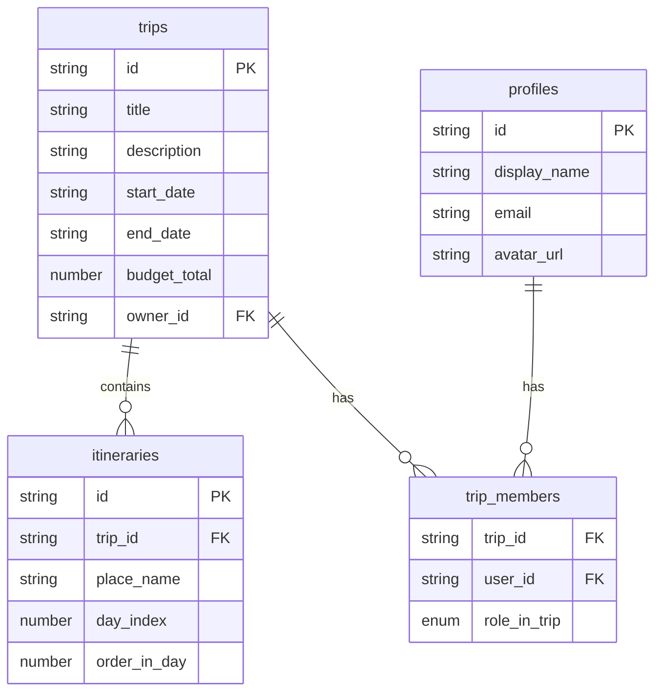

# 旅行共有機能の実装計画

## 1. 現在のデータベース構造（特に旅行とユーザーの関係）

現在のデータベース構造は以下のようになっています：



- `trips`テーブル：旅行の基本情報を格納（owner_idフィールドで所有者を指定）
- `profiles`テーブル：ユーザープロファイル情報を格納（id, display_name, avatar_url, email）
- `trip_members`テーブル：旅行とユーザーの関連付けを格納（role_in_tripフィールドでユーザーの役割を指定）
- `role_in_trip`列挙型：owner, editor, viewerの3種類の役割がある

## 2. 必要なデータベース変更

現在の構造で旅行共有機能を実装することが可能です。既存の`trip_members`テーブルを使用して、ユーザーを旅行に関連付けることができるため、新しいテーブルは必要ありません。

## 3. 必要なAPIエンドポイント（実装優先順位：高）

### 3.1 メールアドレスでユーザーを検索するAPI

```typescript
// src/services/user/findUserByEmail.ts
import { createClient } from "@services/supabase/server";

export const findUserByEmail = async (email: string) => {
  const supabase = await createClient();
  
  const { data, error } = await supabase
    .from("profiles")
    .select("id, display_name, email")
    .eq("email", email)
    .single();
  
  if (error || !data) {
    return { user: null, error: "ユーザーが見つかりませんでした" };
  }
  
  return { user: data, error: null };
};
```

### 3.2 ユーザーを旅行に招待するAPI（オーナー権限チェック強化版）

```typescript
// src/services/trip/shareTrip.ts
import { createClient } from "@services/supabase/server";

export const shareTrip = async (tripId: string, userId: string, currentUserId: string) => {
  const supabase = await createClient();
  
  // 現在のユーザーが旅行のオーナーであることを確認
  const { data: tripMember } = await supabase
    .from("trip_members")
    .select("role")
    .eq("trip_id", tripId)
    .eq("user_id", currentUserId)
    .single();
  
  if (!tripMember || tripMember.role !== "owner") {
    return { success: false, error: "この操作はオーナーのみ実行できます" };
  }
  
  // 既に共有されているか確認
  const { data: existingMember } = await supabase
    .from("trip_members")
    .select("*")
    .eq("trip_id", tripId)
    .eq("user_id", userId)
    .single();
  
  if (existingMember) {
    return { success: false, error: "既にこのユーザーと共有されています" };
  }
  
  // 共有設定を追加
  const { error } = await supabase
    .from("trip_members")
    .insert([
      {
        trip_id: tripId,
        user_id: userId,
        role: "editor" // 要件に基づき、全ての共有相手はeditorロール
      }
    ]);
  
  if (error) {
    return { success: false, error: error.message };
  }
  
  return { success: true, error: null };
};
```

## 4. フロントエンド実装の概要（実装優先順位：中）

### 4.1 共有モーダルコンポーネント（視覚的フィードバック強化版）

```typescript
// src/client/features/share-trip-modal/share-trip-modal.tsx
"use client";

import { useState } from "react";
import { Button } from "@/ui/button";
import { Input } from "@/ui/input";
import { Modal } from "@/client/components/modal";
import { CheckCircleIcon, AlertCircleIcon } from "lucide-react";
import { findUserByEmail } from "@/services/user/findUserByEmail";
import { shareTrip } from "@/services/trip/shareTrip";
import { useSignedUser } from "@/client/hooks/useSignedUser";

interface ShareTripModalProps {
  tripId: string;
  isOpen: boolean;
  onClose: () => void;
}

export function ShareTripModal({ tripId, isOpen, onClose }: ShareTripModalProps) {
  const [email, setEmail] = useState("");
  const [error, setError] = useState<string | null>(null);
  const [success, setSuccess] = useState<string | null>(null);
  const [isLoading, setIsLoading] = useState(false);
  const { user } = useSignedUser();

  const handleShare = async (e: React.FormEvent) => {
    e.preventDefault();
    setError(null);
    setSuccess(null);
    setIsLoading(true);

    if (!user) {
      setError("ユーザー情報が取得できません");
      setIsLoading(false);
      return;
    }

    try {
      // メールアドレスでユーザーを検索
      const { user: foundUser, error: findError } = await findUserByEmail(email);
      
      if (findError || !foundUser) {
        setError("指定されたメールアドレスのユーザーが見つかりません");
        setIsLoading(false);
        return;
      }
      
      // 旅行を共有
      const { success, error: shareError } = await shareTrip(tripId, foundUser.id, user.id);
      
      if (shareError || !success) {
        setError(shareError || "共有に失敗しました");
        setIsLoading(false);
        return;
      }
      
      setSuccess(`${foundUser.display_name}さんと旅行を共有しました`);
      setEmail("");
    } catch (err) {
      setError("エラーが発生しました");
    } finally {
      setIsLoading(false);
    }
  };

  return (
    <Modal isOpen={isOpen} onClose={onClose} title="旅行を共有">
      <form onSubmit={handleShare} className="space-y-4">
        <div>
          <label htmlFor="email" className="block text-sm font-medium">
            メールアドレス
          </label>
          <Input
            id="email"
            type="email"
            value={email}
            onChange={(e) => setEmail(e.target.value)}
            placeholder="共有したいユーザーのメールアドレス"
            required
          />
          <p className="mt-1 text-xs text-gray-500">
            ※登録済みのユーザーのメールアドレスを入力してください
          </p>
        </div>
        
        {error && (
          <div className="flex items-center gap-2 rounded-md bg-red-50 p-3 text-red-700">
            <AlertCircleIcon size={16} />
            <p className="text-sm">{error}</p>
          </div>
        )}
        
        {success && (
          <div className="flex items-center gap-2 rounded-md bg-green-50 p-3 text-green-700">
            <CheckCircleIcon size={16} />
            <p className="text-sm">{success}</p>
          </div>
        )}
        
        <div className="flex justify-end gap-2">
          <Button type="button" variant="outline" onClick={onClose}>
            キャンセル
          </Button>
          <Button type="submit" disabled={isLoading}>
            {isLoading ? "処理中..." : "共有"}
          </Button>
        </div>
      </form>
    </Modal>
  );
}
```

### 4.2 共有ボタンコンポーネント（オーナーのみ表示版）

```typescript
// src/client/features/share-trip-modal/_parts/share-trip-button.tsx
"use client";

import { useState } from "react";
import { ShareIcon } from "lucide-react";
import { Button } from "@/ui/button";
import { ShareTripModal } from "../share-trip-modal";

interface ShareTripButtonProps {
  tripId: string;
  isOwner: boolean; // オーナーかどうかを示すプロパティを追加
}

export function ShareTripButton({ tripId, isOwner }: ShareTripButtonProps) {
  const [isModalOpen, setIsModalOpen] = useState(false);

  // オーナーでない場合はボタンを表示しない
  if (!isOwner) {
    return null;
  }

  return (
    <>
      <Button
        variant="outline"
        size="sm"
        onClick={() => setIsModalOpen(true)}
        className="flex items-center gap-1"
      >
        <ShareIcon size={16} />
        共有
      </Button>
      
      <ShareTripModal
        tripId={tripId}
        isOpen={isModalOpen}
        onClose={() => setIsModalOpen(false)}
      />
    </>
  );
}
```

### 4.3 旅行詳細ページへの共有ボタン追加（オーナー確認版）

```typescript
// src/app/protected/trips/[id]/_parts/trip-hero.tsx の修正
import { ShareTripButton } from "@/client/features/share-trip-modal/_parts/share-trip-button";

// 既存のコンポーネントに共有ボタンを追加
interface TripHeroProps {
  trip: {
    id: string;
    title: string;
    description: string;
    // その他のプロパティ
  };
  tripDays: number;
  membership: {
    role: "owner" | "editor" | "viewer";
  };
}

export default function TripHero({ trip, tripDays, membership }: TripHeroProps) {
  const isOwner = membership.role === "owner";

  return (
    <div className="...">
      <div className="...">
        <h1>{trip.title}</h1>
        <p>{trip.description}</p>
        {/* 他の既存の要素 */}
      </div>
      <div className="flex items-center gap-2">
        {/* 既存のボタンがあればここに */}
        <ShareTripButton tripId={trip.id} isOwner={isOwner} />
      </div>
    </div>
  );
}
```

## 5. 実装手順の提案

1. **サービス関数の実装**（優先度：高）
   - `findUserByEmail.ts`を作成して、メールアドレスでユーザーを検索する機能を実装
   - `shareTrip.ts`を作成して、ユーザーを旅行に招待する機能を実装（オーナー権限チェック付き）

2. **UIコンポーネントの実装**（優先度：中）
   - 共有モーダルコンポーネント（`share-trip-modal.tsx`）を実装（視覚的フィードバック強化版）
   - 共有ボタンコンポーネント（`share-trip-button.tsx`）を実装（オーナーのみ表示版）

3. **旅行詳細ページの修正**（優先度：中）
   - `trip-hero.tsx`に共有ボタンを追加（オーナー確認版）
   - `page.tsx`から`membership`情報を`trip-hero.tsx`に渡すように修正

## 6. セキュリティ考慮事項

1. **アクセス制御**
   - 旅行のオーナーのみが共有設定を変更できるようにする（UIレベルとサーバーレベルの両方でチェック）
   - 共有されたユーザーのみが旅行にアクセスできるようにする

2. **入力検証**
   - メールアドレスの形式を検証
   - 存在しないユーザーへの共有試行を適切に処理

3. **エラーハンドリング**
   - ユーザーが見つからない場合のエラーメッセージ
   - 既に共有されている場合のエラーメッセージ
   - 権限がない場合のエラーメッセージ
   - その他のエラーケースの適切な処理
